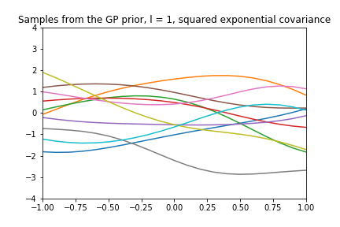
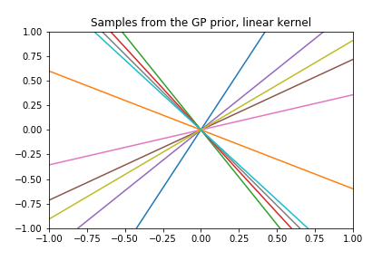
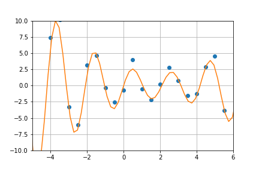
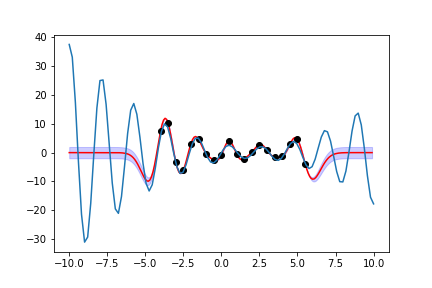
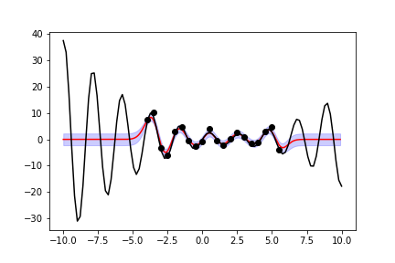

# Gaussian-processes
Demonstration of Gaussian processes for a simple regression problem

A Gaussian process with RBF kernel:

And with linear kernel:

The simple regression problem is a sinusoidal function with noise added: 

Predictive posterior without taking the noise into account: 

Taking the noise into account:

